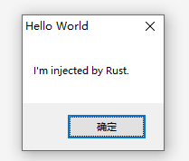

<div align="center">



# `injrs`

**DLL injector library and tool written in Rust. Rust 实现的DLL注入工具/库**

[](https://github.com/jiusanzhou/injrs/actions/workflows/ci.yml)
[](https://crates.io/crates/injrs)
[](https://docs.rs/injrs)
[](https://deps.rs/repo/github/jiusanzhou/injrs)
[](https://github.com/jiusanzhou/injrs/blob/master/LICENSE)

</div>

## Install

Go to [releases page](releases) download the latest binary.

Or if you have rust installed, use cargo to install:
```bash
cargo install injrs
```

Install rust if you don't have.
```bash
curl --proto '=https' --tlsv1.2 -sSf https://sh.rustup.rs | sh
```

## Usage

At most time, you can use `injrs` as a simple tool.

```bash
USAGE:
injrs PROCESS_NAME/PID [Libraies...]

EXAMPLES:
1. Inject test.dll to process Calc.exe
    $ injrs Calc.exe test.dll

2. Inject test.dll and demo.dll to process with PID: 1888
    $ injrs 1888 test.dll demo.dll
```

## DLL Demo

The code in [examples/hellobox](./examples/hellobox) is a simple message box dll for testing injector.

You can build with command:
```bash
cargo build --release --example hellobox
```

Build target will locate in:
```bash
target/i686-pc-windows-msvc/release/examples/hellobox.dll
```

Try to inject the demo dll to your target process:
```bash
injrs PID/PNAME target/i686-pc-windows-msvc/release/examples/hellobox.dll
```

## Usage as library

You also can write a injector project using `injrs` as a library.

```rust
use injrs::process_windows::*;
use injrs::inject_windows::*;

fn main() {
    let name = "Calc.exe";
    let dll = "./my-demo-dll.dll";
    let process = Process::find_first_by_name(name).unwrap();

    print!("inject dll to process => ");
    match process.inject(dll) {
        Err(e) => {
            println!("error: {}", e);
        },
        Ok(_) => {
            println!("success");
        }
    }
}
```

for more detail you can check [src/main.rs](./src/main.rs).
